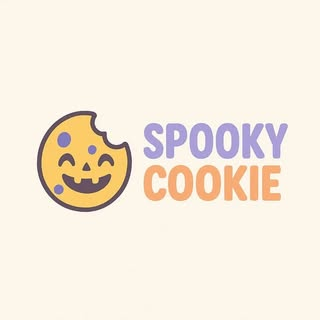

# SpookyCookie

**SpookyCookie** Tienda web de galletas artesanales hecha con **Next.js** y **React**.  
Proyecto diseñado para mostrar productos, gestionar pedidos y ofrecer una experiencia moderna, dulce y responsiva..

---

## ✨ Características

- 🍪 Catálogo de productos por categorías.
- 🛒 Carrito de compras con persistencia.
- 👤 Sistema de inicio de sesión y perfil de usuario.
- 📦 Panel de administración para productos, pedidos y clientes.
- 📅 Calendario de entregas.
- 💌 Formulario de contacto.
- 📱 Diseño responsivo para móvil, tablet y desktop.

---

## 🛠️ Tecnologías

- **Next.js**
- **React**
- **JavaScript**
- **CSS Modules / Global CSS**
- **MariaDB / MySQL**
- **bcryptjs**
- **Node.js**

---
